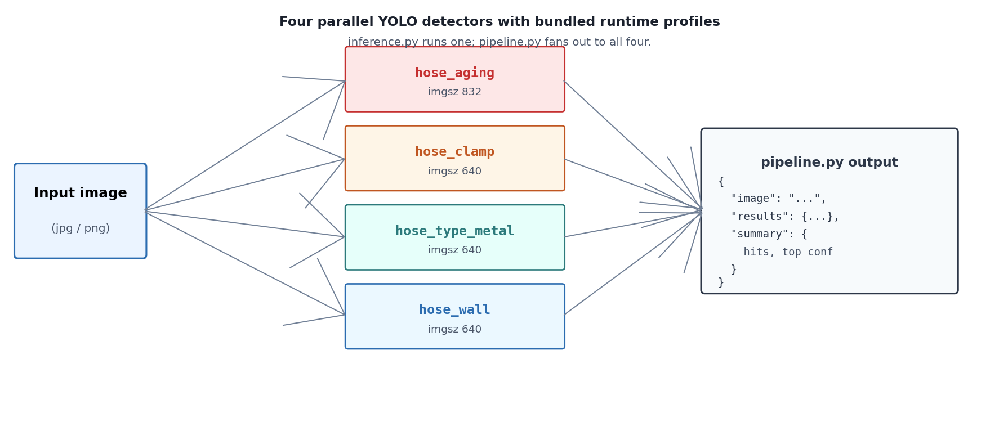

# hose-anomaly-detection

[English](README.md) · 简体中文

> 四个预训练 YOLO 检测器，专做软管巡检——老化、喉箍异常、软管类型、穿墙。
> PyTorch + ONNX 权重，自带人工真值集调过的运行参数。

[](https://github.com/ychenfen/hose-anomaly-detection/actions/workflows/ci.yml)
[](LICENSE)




跑一张图试试：

```bash
python3 pipeline.py --image examples/demo.jpg --save-dir examples/runs
```

（往 `examples/demo.jpg` 放什么，看 [examples/README.md](examples/README.md)。）

---

每个模型只盯一种异常，并自带在人工复核真值集上调过的运行参数（置信度阈值 + 面积比上下限），调用方拿来即用，不用自己再扫一遍阈值。

| 模型 | 类别 | 输入尺寸 | 检测目标 | 运行 conf |
|---|---|---|---|---|
| `hose_aging` | `hose aging` | 832 | 软管老化 / 氧化 / 龟裂 / 腐蚀 / 破损 | 0.50 |
| `hose_clamp` | `clamp_abnormal` | 640 | 喉箍异常（松脱、缺失、变形等） | 0.35 |
| `hose_type_metal` | `metal_clad_hose`, `non_standard_hose` | 640 | 金属护套软管 / 非标软管（双类） | 0.50 / 0.45 |
| `hose_wall` | `hose penetrating the wall` | 640 | 软管穿墙 | 0.45 |

四个都是 Ultralytics YOLO 检测模型，其中三个除 `.pt` 之外还附带 `.onnx` 导出，方便非 Python 部署。整个权重包约 130 MB。

## 目录结构

```
hose-anomaly-detection/
├── README.md / README.zh.md
├── LICENSE
├── requirements.txt
├── inference.py            单模型 CLI
├── pipeline.py             四模型一起跑
├── verify_checksums.py     SHA-256 校验
├── SHA256SUMS.txt
└── models/
    ├── hose_aging/         .pt + classes.txt + model_card.json
    ├── hose_clamp/         .pt + .onnx + classes.txt + model_card.json
    ├── hose_type_metal/    .pt + .onnx + classes.txt + model_card.json
    └── hose_wall/          .pt + .onnx + classes.txt + model_card.json
```

每个模型目录下的 `model_card.json` 是该模型的真相源：类别、推荐阈值、训练 regime、人工真值集上的指标。两个 CLI 都直接读它，所以阈值不会在脚本里漂。

## 安装

```bash
git clone https://github.com/ychenfen/hose-anomaly-detection.git
cd hose-anomaly-detection
python3 -m venv .venv && source .venv/bin/activate
pip install -r requirements.txt
python3 verify_checksums.py
```

`verify_checksums.py` 不是必须，但建议跑一次——`.pt` 文件如果在传输中坏了，不会报错，只会安静地输出乱七八糟的检测结果，校验比事后排查省事。

## 用法

单模型，输出 JSON 到 stdout：

```bash
python3 inference.py --model hose_wall --image path/to/img.jpg
```

单模型，同时存一张画了框的可视化结果：

```bash
python3 inference.py --model hose_clamp --image img.jpg --save out/clamp.jpg
```

覆盖默认阈值（一般不用，model card 里的默认值已经调过）：

```bash
python3 inference.py --model hose_aging --image img.jpg --conf 0.6
```

四个模型一起跑，每个模型导出一张可视化图：

```bash
python3 pipeline.py --image img.jpg --save-dir runs/demo
```

挑选部分模型跑：

```bash
python3 pipeline.py --image img.jpg --models hose_wall hose_clamp
```

`pipeline.py` 输出一份按模型名分组的 JSON，外加一个 `summary` 块包含每个模型的命中数和最高置信度——方便接下游规则引擎。

## 各模型运行档位

下面这些是实际生产用的档位，背后是几轮在人工真值集上的阈值扫描结果。几个值得提的细节：

- **`hose_aging`** 严格走"只报异常"路线，`conf=0.50`，`min_area_ratio=0.0005`。蓝管、绿管、正常旧管和纯负场景都留空——它行为上更像分类报警器，不是宽松检测器。
- **`hose_clamp`** 是单类（只有 `clamp_abnormal`，没有 `clamp_normal` 头）。运行参数 `conf=0.35`，`min_area_ratio=0.001`。clean negative 误报率压到 ~0.5% 不靠阈值，靠的是微调阶段加了一批"明确指令的负样本"做直接负采样。
- **`hose_type_metal`** 是唯一的双类检测器，两个头用不同阈值（更安全的 `metal_clad_hose` 用 0.50，更高风险的 `non_standard_hose` 用 0.45）。当同一框上两类都触发时，`inference.py` 只在高风险类置信度比安全类高出至少 `0.20` 时才升级——见 `inference.py` 里的 `_merge_two_class`。这条规则是为了防止正常的金属护套区域因为一点点分数差就被误升级成非标。
- **`hose_wall`** 生产用 `conf=0.45`，`min_area_ratio=0.0005`，另外保留了 `viewer_review_min_conf=0.25` 给人审 UI 用——查图时可以看到低分真阳性，但不会污染生产侧的误报预算。

`min_area_ratio` 是按原图面积计算，不是模型输入尺寸。

## 主要指标

下面是人工真值集（reviewed truth）的合并指标，不是原训练集 val。"人工真值"指图片由人重新标了一遍，不直接信训练标签。

| 模型 | 评估集 | Precision | Recall | F1 |
|---|---|---|---|---|
| `hose_aging` | 7 桶人工真值 / 335 张 | 0.859 | 0.743 | 0.797 |
| `hose_clamp` | 运行评估 / 219 + 358 张 | — | — | 正样命中 0.963、clean-neg 误报 0.005 |
| `hose_type_metal` | 5 桶人工真值 / 306 张 | 0.857 | 0.803 | 0.829 |
| `hose_wall` | 4 桶人工真值 / 404 张 | 0.909 | 0.859 | 0.883 |

每个模型在每个桶上的细分（包括它输的那些桶）都在 `model_card.json` 里。

## 已知短板

- `hose_aging` 设计上就是 anomaly-only，老化形态偏窄的桶上召回会塌（最难的桶 F1 只有 0.18 左右）。如果想把临界老化推给人工复核，把 `conf` 降到 0.30 左右就行，但误报率大概会涨三倍。
- `hose_type_metal` 在 `non_standard_hose` 上的合并 recall 是 0.80。一小部分长得很像金属护套的难样本仍会漏——上面提到的双类 gap 规则是个明确的"宁愿少报、不要乱升级"的取舍。
- `hose_wall` 留着一个明确的难样本：那个穿墙位置被部分遮挡了，连最低复核阈值 0.25 都给不出稳定框。如果你做的下游流水线假设穿墙是 100% 召回，记得避开这种情况。
- 四个权重的训练输入尺寸如表（aging 是 832，其他 640）。如果你换 `imgsz` 跑，上面这套阈值就不再适用，需要重新扫。

## License

MIT，见 [LICENSE](LICENSE)。
